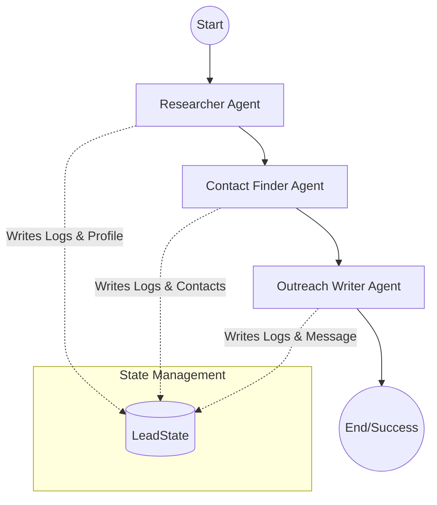

# AI Lead Intelligence System 🚀

A production-ready, **Multi-Agent** lead research and outreach engine built with **Next.js**, **LangGraph**, and **Gemini 2.5 Flash**.

---

## 🏗 Multi-Agent Architecture

This system uses a **Directed Acyclic Graph (DAG)** orchestrated by **LangGraph** to coordinate specialized AI agents. Each agent has a unique role, prompt, and input/output contract.

### 🧩 Agent Definitions

| Agent | Role | Tools | Output Contract |
|-------|------|-------|-----------------|
| **Researcher** | Deep business profiling & HQ discovery | Exa Web Search | `BusinessProfile` (Summary, Scale, Tech Stack, HQ) |
| **Contact Finder** | Locating verified contact data | Exa Web Search | `ContactCard` (Phone, Email, WhatsApp + Source Labels) |
| **Outreach Writer** | Personalized sales copywriting | None (Brain) | `OutreachMessage` & `Reasoning` |

### 🔄 The Workflow (LangGraph)



---

## 🌟 Key Features

### 📡 Real-time Streaming (Visibility)
The system uses **NDJSON streaming** to push agent updates to the UI in real-time. You can watch the agents think through the **Multi-Agent Activity Log**.

### 🔗 Grounded Credibility
- **Source Links**: Every contact field is grounded with a clickable source URL.
- **Source Labels**: Specific explanations like "Found via company website" or "Found via LinkedIn".
- **Tech Stack Disclaimers**: Explicitly marks tech data as "Confirmed" or "Inferred" to maintain trust.

### 🛡 Failure Handling
- **Explicit Fallbacks**: No "Loading..." dead-ends. Fields show "Not found" or "Not publicly available" if research fails.
- **Smart HQ Recovery**: Automatically fixes "Unknown" locations by performing a pre-research HQ discovery step.

---

## 🚀 Getting Started

1. **Clone & Install**:
   ```bash
   npm install
   ```

2. **Environment Variables**:
   Create a `.env` file:
   ```env
   GOOGLE_API_KEY=your_key
   EXA_API_KEY=your_key
   ```

3. **Run**:
   ```bash
   npm run dev
   ```

---

## 🛠 Tech Stack
- **Framework**: Next.js 15 (App Router)
- **AI Orchestration**: LangGraph / LangChain
- **LLM**: Gemini 2.5 Flash
- **Search**: Exa AI
- **UI**: Tailwind CSS + Aceternity UI
